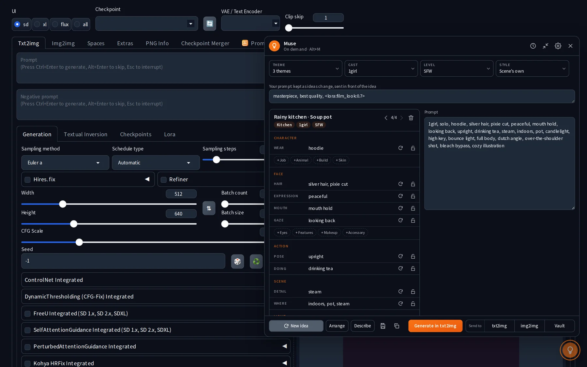
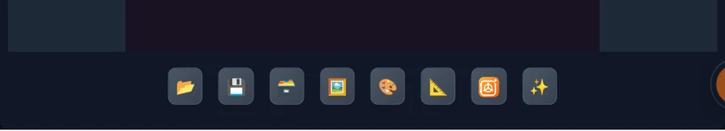
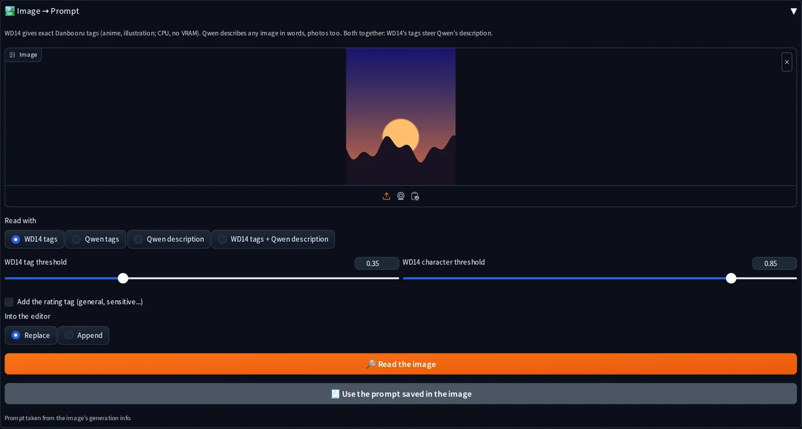
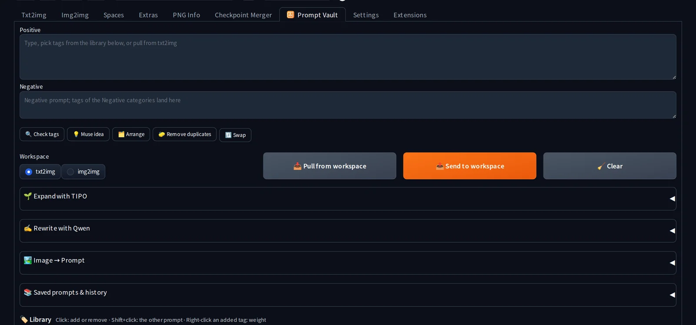
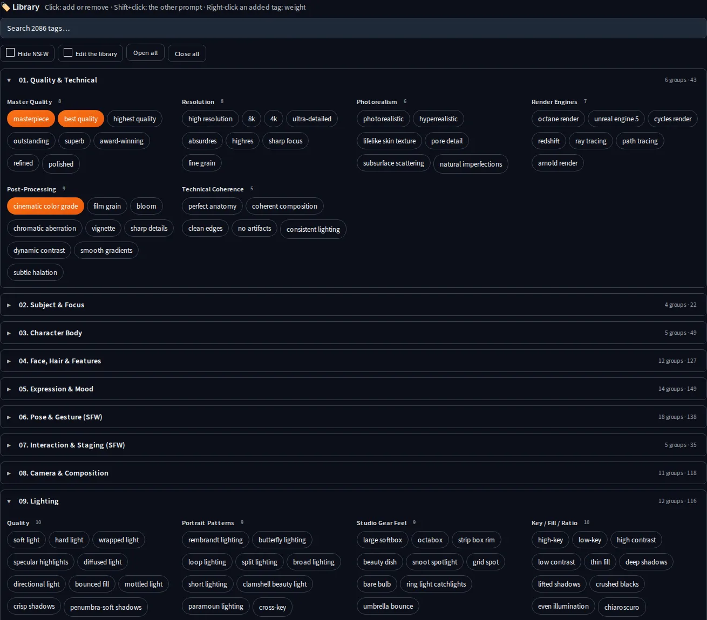
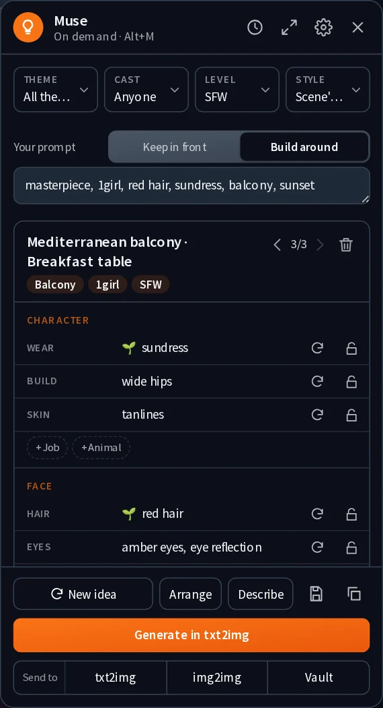
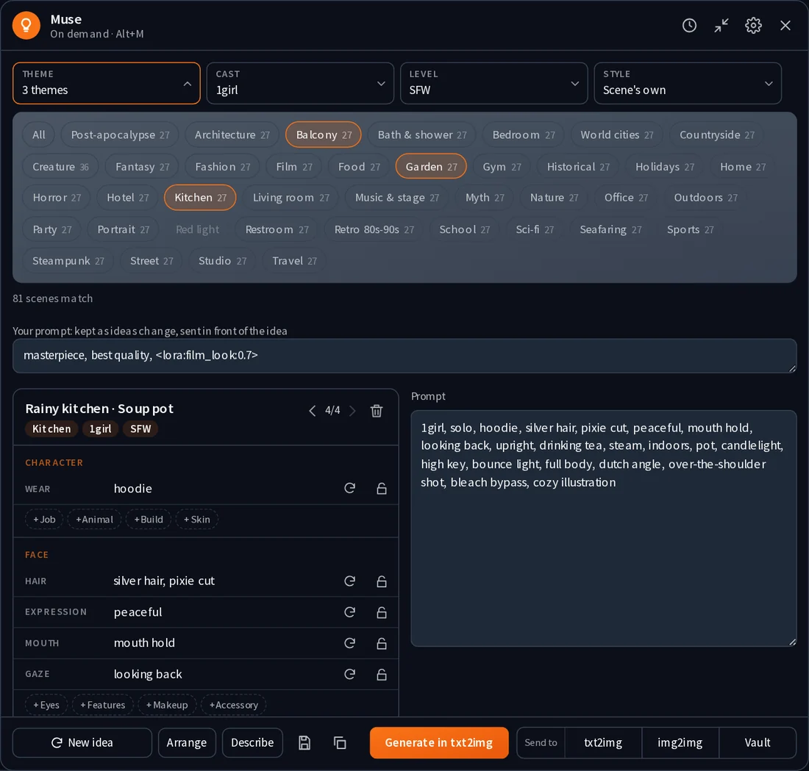
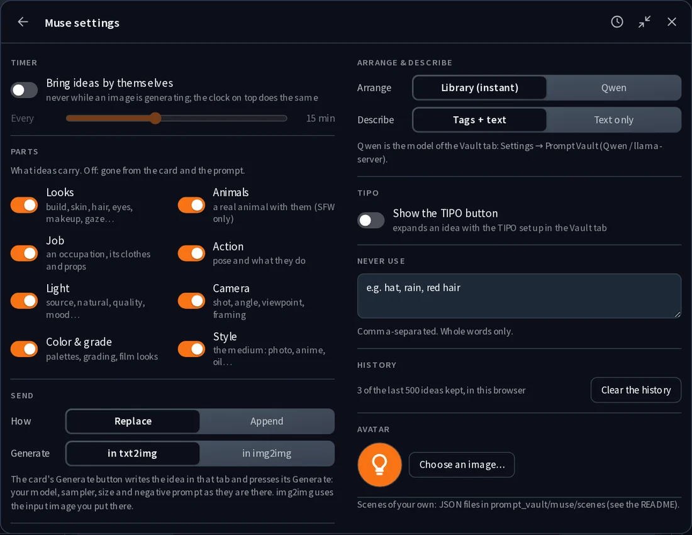
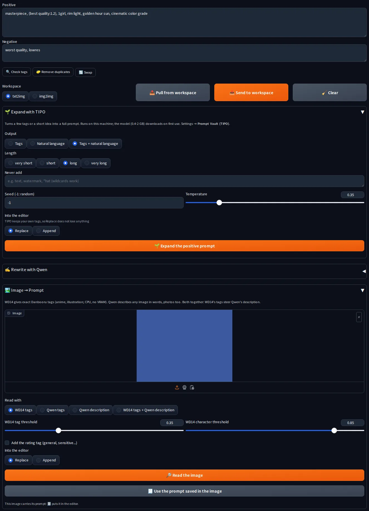

<p align="center"></p>

# Stable Diffusion WebUI Prompt Vault

**Version 1.0.0** · [v.1.0.0](CHANGELOG.md)

A prompt workbench for **Stable Diffusion WebUI Forge**, **reForge** and **Forge Classic (Neo)**:
a searchable tag library, saved prompts and history, and three local AI helpers (TIPO,
Qwen-VL and the WD14 tagger) in one tab.



## Features

- **Editor.** A positive and a negative prompt, pulled from and sent to txt2img or img2img.
- **Tag library.** 2,000+ tags in 20 categories. Click a tag to add it, click again to
  remove it; tags already in the prompt are lit.
  - **Search** across the whole library.
  - **Right-click** an added tag to change its weight: `(tag:1.2)`.
  - **Shift+click** sends a tag to the other prompt. Tags of the *Negative* categories go
    to the negative prompt by themselves.
  - **Hide NSFW** hides the categories with NSFW in their name, for when the screen is shared.
- **Library editing, no reload.** Add, rename, move and delete tags, groups and
  categories; import and export the library as JSON.
- **Suggestions while you type**, from your library and about 10,000 Danbooru tags.
  **🔍 Check tags** lists the tags that are neither (typos, made-up tags) and adds them to
  the library in one click.
- **🗂️ Arrange** puts the tags of the editor in the usual order (quality, who, body, face,
  clothes, pose, place, time, light, colour, camera, style) and drops duplicates. It knows
  what each tag is from your library's categories and the Danbooru vocabulary, so it is
  instant; **✍️ Qwen → Arrange tags** does the same with the model, and also merges
  near-duplicates, drops contradictions and fixes misspelt tags.
- **💡 Muse idea** puts an idea from Muse (with the filters set on its card) in the editor.
- **Saved prompts**: the positive and negative prompt under a name, with a thumbnail.
- **History**: the prompts of your last generations, one click from coming back.
- **🌱 TIPO** turns a few tags or a short idea into a full prompt.
- **✍️ Qwen** rewrites a prompt: tags into a paragraph, a paragraph into tags, any
  language into English, or any instruction ("make it night time").
- **🏞️ Image → Prompt**: exact Danbooru tags with WD14, a description with Qwen, or both.
  An image made by the WebUI gives back its own prompt with 🧾.
- **Send to Prompt Vault**: a button with the extension's icon under the txt2img and
  img2img galleries, next to the WebUI's own "send to" buttons. It takes the image shown
  there to Image → Prompt; read it, or take back the prompt saved in it.

  

  

  

  

- **💡 Muse**, a floating button on every tab that gives prompt ideas when you ask
  (click it, or `Alt+M`), or by itself every 5–30 minutes with the clock on its card
  (never while an image is generating).
  - **Three filters**: *Theme* (39: Portrait, Fashion, Film, Horror, Street, Home, Food,
    Architecture, Nature, Creature, Myth, Sci-fi, Sports, Party, Bath & shower, Bedroom,
    Fantasy, Gym, Hotel, Office, Outdoors, Studio, Travel, Countryside, Historical,
    Post-apocalypse, Steampunk, Seafaring, Music & stage, World cities, Retro 80s-90s,
    Holidays, Red light, Kitchen, Living room, Balcony, Garden, Restroom, School), *Cast*
    (no humans, 1girl, 1boy, 1girl 1boy, 2girls, 2boys, girls 3+, boys 3+, 1boy + girls
    (harem), 1girl + boys (reverse harem), mixed group, furry, kemono, human + furry, myth &
    fantasy beings, monsters, sci-fi beings, animals; groups of 3, 4, 5
    or 6+, with their count tags written for you: `1boy, 3girls, multiple girls, harem`) and *Level*
    (SFW, suggestive, nude, explicit; the last three stay locked until NSFW is on). Each
    choice shows how many scenes it leaves: about 4,100 scenes, nine places per theme with
    three spots each (a café's window seat, counter and terrace, each with its own Where and
    Detail), so every theme, cast, level and group size goes with every other 27 times. The
    one thing that cannot be is greyed out with the reason: *No humans* and *Animals* are SFW only,
    *Red light* is NSFW only and *School* is SFW only.
  - **Beings**: *Myth & fantasy* (vampire, elf, dark elf, demon, succubus, angel, fallen angel,
    kitsune, oni, mermaid, dryad, centaur, lamia, harpy, dragon girl, orc, minotaur, pixie,
    gorgon…), *Monsters* (werewolf, Frankenstein's monster and his bride, zombie, ghost, mummy,
    gargoyle, golem, lich, slime girl, arachne…), *Sci-fi beings* (android, gynoid, robot,
    cyborg, mecha musume, mecha, alien, hologram…), *Animals* (real ones, SFW only). The
    Creature theme has twelve places for them: a vampire castle, a werewolf forest,
    Frankenstein's lab, a demon realm, a celestial sanctuary, a dragon roost, an elven grove,
    an orc war camp, a pixie garden, a robot factory, an alien world, a wildlife reserve.
  - **When**: the hour and the sky, for every spot that has one (outdoors, or a room with a
    window, a balcony, a skylight): `morning, clear sky`, `night, rain`, `evening, snowing`.
    Every Where says `outdoors` or `indoors`. The other parts follow the sky: no golden hour
    at night, no sunbathing in the rain, no starry sky at noon; a desert gets no rain, a
    night market no morning. Lock the When part and roll the rest, or the other way round.
  - **Tags, never sentences.** Every part is written the way a prompt is: `sitting by window,
    holding cup`, not "she sits by the window holding her cup"; no "she in…, he in…".
  - **Act and Kink**, a second tier of filters once NSFW is on: what happens in the scene.
    *Act* picks the family of the explicit act: vaginal, anal, oral, hands & body (handjob,
    fingering, paizuri, tribadism…) or solo. A position ("doggystyle", "mating press") is
    penetration without saying where: vaginal or anal, as the Act filter says.
    *Kink*, 32 of them: BDSM, bondage, toys, fluids, breeding & x-ray, pregnancy & lactation,
    anal, oral, femdom, feet, pet play, costume play, exhibitionism & voyeurism, hypnosis &
    mind control, watersports, scat, latex & fetish wear, bites & marks, size difference,
    small dom big sub, big dom small sub, muscle growth, transformation, inflation & bulge,
    belly inflation, male pregnancy, chastity; tentacles, slime, monsters, corruption and blood & bites only in the
    themes they belong to.
    A kink goes with the act: an x-ray shows the womb with vaginal sex, the rectum with anal,
    the throat with a blowjob, and never a womb with a blowjob. Breeding works for 2boys and
    2girls too (male pregnancy, knotting; a strap-on). A kink that is an act of
    its own (footjob, pegging, golden shower) takes the Doing's place. Casts and acts a kink has
    nothing for are greyed out with the reason.
  - **Body**, a part of every NSFW idea: breasts, nipples, pussy, pectorals, chest hair,
    penis, body hair, prosthetics on androids and in Sci-fi; for anthros the anatomy of their
    kind (canine knot and sheath, flared equine, spiked feline, ribbed or scaled reptile,
    hemipenes, multiple breasts…). A switch in the settings turns it off.
  - **Futanari**: Futa, Futa + girl and Futa + boy casts, NSFW only.
  - **Furry**: 34 kinds of anthro (canines, felines, hooved, rodents, bears, birds, sharks,
    orcas and dolphins, reptiles, dragons), each with its own body (stripes, spots, mane,
    horns, antlers, scales, feathers, wings, fins…) and anatomy, written as tags:
    `1furry, solo, anthro female, fox, orange fur, fluffy tail`. **Human + furry** puts a
    human and an anthro in one frame: `1furry, interspecies, 1girl, anthro male, human with
    furry, wolf, grey fur…` (`human on furry` or `furry on human` when explicit). A werewolf
    is a monster, not a furry: it is a non-human.
  - **Pose** comes from the library's pose groups, for a woman or a man, and fits what the
    idea is doing and where: no "lying on back" for someone riding, no sprinting in a
    restroom, no heroic stance in a kitchen. **Style**, a fifth filter, swaps the
    scene's styles for families of the library's Style & Medium category (pixel art,
    silhouette, vaporwave, stained glass, double exposure, anime eras…).
  - **Save** keeps the idea in the Vault tab's Saved prompts.

  <p>
  </p>

  

  - **Red light**, a theme with no SFW side: brothel parlor, strip club, love hotel, BDSM
    dungeon, red-light windows, massage parlor, private club, peep show, adult film set.
  - **Every idea is a scene**, so its parts belong together, in groups on the card:
    *Character* (who, job, wear, build, skin, body), *Face* (hair colour and style, by sex;
    eyes, colour and details; eyebrows, nose and lips; makeup; accessories; expression;
    mouth; gaze), *Action* (pose, doing, kink, effects), *Scene* (detail, where, when),
    *Light* (the scene's source, natural light, quality, mood, support light, volume),
    *Camera* (shot size, angle and tilt, viewpoint, framing and lens) and *Look* (colour &
    grading, style). Each group shows a row per part, and the parts this idea left out as
    small **+** chips that draw them. **↻** draws one part again, **🔒** keeps it for the next
    idea (same scene). **Settings → Parts** turns whole groups off (Looks, Animals, Job,
    Action, Light, Camera, Color & grade, Style): off, a group is gone from the card and the
    prompt, the scene's own light or camera too, and the idea on the card follows at once.
    Small parts are drawn only where they add something: no "grin" when the Doing already
    smiles, no gaze when it already says where the eyes are, no angle the shot already gives.
  - **Animal**: now and then a real animal with the people of an SFW idea, one that fits
    the theme (a cat on the lap at home, a dog on a leash in the street, a horse in the
    countryside, a raven in a horror scene).
  - **Job**: now and then an idea has an occupation that fits its theme, real (nurse, chef,
    barista, firefighter, detective, pilot, DJ, astronaut…) or not (knight, wizard, witch,
    necromancer, bounty hunter, netrunner, dragon rider…), and then the Wear, the accessories
    and the effects are the job's: a wizard's robe, staff and glowing runes. Fiction stays in
    its own worlds: knights and witches only in Fantasy and Myth, netrunners and mecha pilots
    only in Sci-fi, airship pilots only in Steampunk, samurai and geishas in Historical.
  - **Generate in txt2img** writes the idea in txt2img and presses its Generate button: your
    model, sampler, size and negative prompt as they are. The image comes back on the card.
    **Settings → Send → Generate in** switches it to img2img (with the input image you put
    there); the button says which tab it uses.
  - **Send to txt2img, img2img or the Vault editor** right from the card, replacing or
    appending. Muse writes the positive prompt only: your negative prompt stays yours.
  - **Your prompt**, a box under the filters for what every idea should start with
    (`masterpiece, best quality, <lora:name:0.8>`): new ideas never touch it, and Send,
    Generate, Copy and Save put it in front of the idea, joined by a comma. Muse remembers it.
  - The tools of the Vault tab, on the card: **Arrange** (the library, instant, or Qwen),
    **Describe** (Qwen writes a paragraph from the tags, after them or instead of them) and
    **TIPO**. They use the models already set up for the Vault tab.
  - Edit the prompt before sending, step back through the last 500 ideas with ‹ › (the
    bin next to them, or the settings, clears that history), keep
    words out with **Never use**, give the button your own **avatar**, drag it anywhere.
  - **⤢ Wide card** (on a window 760 px or wider): the parts on the left, the whole prompt
    on the right; the settings in two columns. Muse remembers it.
  - NSFW ideas are adults only: every one carries `mature`, and minor-related words are
    dropped from any scene.



## Your data is safe

The library, saved prompts, history and Muse's settings live **outside the extension**, in a
`prompt_vault` folder in the WebUI folder (**Settings → Prompt Vault** can move it).
Updating or reinstalling the extension never touches them.

- Every save goes to a temporary file first and then replaces the real one, so a crash in
  the middle of a save cannot leave a broken file.
- The last 20 versions of the library are kept in `prompt_vault/backups`.
- **🧺 Add missing default tags** (in *Edit the library*) adds what a newer version of
  the default library has and yours does not. It removes nothing.

**Coming from the first versions?** Those kept the library inside the extension's own
folder (`prompt_vault.json`). On first start, the newest `prompt_vault.json` found in
`extensions/` becomes your library, tags you added included; the old file is left as it
was. Install this version, start the WebUI once, check your tags, then delete the old
extension folder. Keep the two from being enabled at the same time: both would add a
*Prompt Vault* tab.

## Installation

**Extensions → Install from URL**, paste this repository's URL, **Install**, then restart
the WebUI. Or clone it into `extensions/`. Or take the zip of a
[release](https://github.com/sca-285/sd-webui-prompt-vault/releases) and unzip it into
`extensions/` (it makes the `sd-webui-prompt-vault` folder).

Updating: **Extensions → Check for updates**, or a newer release zip over the old folder.
Your library, saved prompts and Muse's settings live in `prompt_vault/` in the WebUI
folder, outside the extension, so an update never touches them.

The library, the editor, saved prompts and history need nothing more.

### The AI models: download them first

Each AI tool needs its model files. **Download them yourself with a browser or a download
manager** before the first use: it is much faster than letting the extension fetch a 1 GB
file over one connection while you wait, and a broken download can be resumed. Direct
links for every model are in **[SETUP_AI.md](SETUP_AI.md)**. The short version, for the
recommended models:

| Tool | Download | Put it in |
|---|---|---|
| WD14 | [model.onnx](https://huggingface.co/SmilingWolf/wd-swinv2-tagger-v3/resolve/main/model.onnx) and [selected_tags.csv](https://huggingface.co/SmilingWolf/wd-swinv2-tagger-v3/resolve/main/selected_tags.csv) (~470 MB) | `models/prompt_vault/wd14/wd-swinv2-tagger-v3/` |
| TIPO | [TIPO-500M-ft-F16.gguf](https://huggingface.co/KBlueLeaf/TIPO-500M-ft/resolve/main/TIPO-500M-ft-F16.gguf) (~1 GB) | `models/prompt_vault/tipo/` |
| llama-server (for TIPO and Qwen) | from [llama.cpp releases](https://github.com/ggml-org/llama.cpp/releases): the zip for your GPU, and for NVIDIA also the matching `cudart-…` zip | unzip both into one folder, e.g. `H:\AI\llama.cpp\`; paste the path of `llama-server.exe` in Settings |
| Qwen-VL | two files of one size: `Qwen3VL-4B-Instruct-Q8_0.gguf` and `mmproj-Qwen3VL-4B-Instruct-F16.gguf` from [Qwen3-VL-4B-Instruct-GGUF](https://huggingface.co/Qwen/Qwen3-VL-4B-Instruct-GGUF/tree/main) | any folder, e.g. `models\VLM\`; paste both paths in Settings |

Which zip fits your GPU, which Qwen size fits your VRAM, and how to check that it all
works: **[SETUP_AI.md](SETUP_AI.md)**, sections 1 and 2.

Keep the file names as they download. Then check the model choices in **Settings →
Prompt Vault (WD14 tagger)**, **(TIPO)** and **(Qwen / llama-server)**.

If a WD14 or TIPO file is missing, the extension still downloads it the first time a
button needs it; the console shows the progress.

The extension installs `onnxruntime` for WD14 when nothing provides it yet. Qwen and
TIPO run in llama-server, a separate program: nothing else is installed into the WebUI.

## Memory

- The AI models load when a button needs them and are **freed after a few idle
  minutes** (Settings). **⏹️ Stop all AI models** frees them at once.
- Qwen and TIPO **never run together** by default.
- While Qwen loads, the checkpoint can leave VRAM and come back afterwards (on by default).
- WD14 runs on the CPU.
- A llama-server left running by a WebUI that crashed is stopped at the next start.

## Settings

**Settings → Prompt Vault**: the data folder, suggestions, history, hiding NSFW by default,
showing Muse at all. Everything else about Muse is on its own panel.
**Prompt Vault (Qwen / llama-server)**, **(TIPO)** and **(WD14 tagger)**: the models and
how they run; see [SETUP_AI.md](SETUP_AI.md).

## Files

```
prompt_vault/            (in the WebUI folder)
├─ library.json          your library
├─ prompts.json          saved prompts
├─ history.json          history
├─ backups/              earlier versions of the library
└─ muse/
   ├─ state.json         Muse's settings
   ├─ avatar.png         your avatar, if you chose one
   └─ scenes/            scenes of your own (optional)
models/prompt_vault/
├─ tipo/
│  └─ TIPO-500M-ft-F16.gguf
└─ wd14/
   └─ wd-swinv2-tagger-v3/
      ├─ model.onnx
      └─ selected_tags.csv
```

## One vocabulary

Muse and the Vault tab share the library. Muse takes its poses and style families from the
library's Pose and Style & Medium categories, so what you add there turns up on its card; the
library ships with everything Muse knows (furry kinds and features, kinks, anatomy, poses by
sex, specialised styles, sex positions). Coming from an earlier version: **Edit the library →
🧺 Add missing default tags** brings these into your library without touching your own tags.

## Checks

`python3 tests/run.py` runs every check of Muse in a WebUI data folder of its own (the WebUI
is stubbed; it needs `fastapi` and `httpx`): tags never prose, the scene files match their
sources in `tools/muse_scenes`, the API, group sizes, thousands of random ideas (adults only,
bodies that fit the cast, skies, jobs in their themes), every act and kink for every cast,
and every chip of every filter with 25 scenes or more. `--quick` skips the slowest. GitHub
runs them on every push (`.github/workflows/tests.yml`).

## Muse scenes of your own

Put JSON files in `prompt_vault/muse/scenes/`; the shipped ones in `data/muse_scenes/` are
examples. A file holds scenes; every entry of a list must suit every entry of the other
lists *of the same scene*, and the ideas stay coherent.

```json
{
  "theme": "Festival", "rating": "sfw",
  "styles": ["film still, 35mm"],
  "scenes": [
    {"title": "Night market", "mood": ["happy", "calm"],
     "subjects": {"1girl": ["yukata, hair ornament"], "1boy": ["jinbei"],
                  "1girl1boy": ["yukata, jinbei"]},
     "gestures": ["looking up"],
     "actions": ["holding candy apple", "looking up, fireworks"],
     "settings": ["summer festival, night, food stalls"],
     "lighting": ["paper lantern light"],
     "camera": ["cowboy shot"],
     "details": ["fireworks, night sky"]}
  ]
}
```

- `subjects` is keyed by cast: `none`, `1girl`, `1boy`, `1girl1boy`, `2girls`, `2boys`,
  `girls`, `boys`, `harem`, `reverse`, `mixed` (groups of 3 and more), `furry`, `kemono`,
  `mythic`, `monster`, `synth`, `animal`, `nonhuman`.
  Muse writes the cast's own tags in front (`1girl, solo`; for a group, its count tags).
- `wear` is what people wear there: `{"f": ["sundress", ...], "m": ["linen shirt", ...]}`, one
  woman's and one man's; Muse puts it together for the cast (a couple, two girls, a group).
  `jobs`, `hair`, `eyes`, `builds`, `colors`, `angles` and the other parts can be given too;
  what a scene leaves out comes from Muse's own lists (lib_vault/looks.py).
  `group` is a group that writes its own count tags.
- `sizes` (3, 4, 5, 6 for 6+) says which group sizes a scene suits, e.g. `[3]` for a
  threesome; a mixed group is 4 or more.
- `rating` is `sfw`, `suggestive`, `nude` or `explicit`, for the file or per scene.
- `mood` picks the faces: calm, happy, serious, tense, melancholy, cool, playful, shy,
  sultry, passion, afterglow. Or list your own `expressions`.
- A list a scene leaves out comes from the file (here `styles`).
- Any list can be given by cast too, so one place serves every cast with what suits it:
  `"actions": {"solo": [...], "pair": [...], "2girls": [...], "groups": [...]}`. `solo` is
  1girl, 1boy, furry and non-human; `pair` the pairs; `groups` the five groups;
  `people` all of them. A cast gets its own entries and those of these names; `*` serves
  the casts nothing names.
- `"templates": {"name": {...}}` holds what several scenes share; a scene with
  `"use": "name"` (or a list of names) starts from it and adds its own entries. The shipped
  files use it: one template per level, one per place, then a scene per spot.
- Write tags, not sentences: short pieces, no "the", "she", "he", "their".
- `times` lists the hours and skies a scene can have (`"night, rain"`, `"morning, clear sky"`:
  morning, day, afternoon, evening, night; clear, cloudy, overcast, rain, fog, snow). Muse
  draws it first and leaves out the entries of the other lists it contradicts. Leave it out
  for a room with no window.
- Packs made for the first versions of Muse still load, each as a theme of its own.
- The shipped scenes are written by `tools/muse_scenes`: one file per theme or few (places,
  their spots, what people do and wear there). `python3 tools/muse_scenes/build.py` writes
  `data/muse_scenes` again, `lint.py` checks that every entry is tags, not prose.

## Credits

- **TIPO** and **KGen** by KohakuBlueLeaf (<https://github.com/KohakuBlueleaf/KGen>,
  Apache-2.0). The TIPO request format and answer parsing are adapted from KGen; see
  [NOTICE.md](NOTICE.md).
- **WD14 tagger** models by SmilingWolf (<https://huggingface.co/SmilingWolf>).
- **Qwen-VL** by the Qwen team; **llama.cpp** by ggml-org.

Thanks also to **Claude**, Anthropic's AI assistant, for help building this extension.

## License

MIT, see [LICENSE](LICENSE). The parts adapted from KGen stay under Apache-2.0, see
[NOTICE.md](NOTICE.md). The models are not part of this repository: each keeps its own license.
